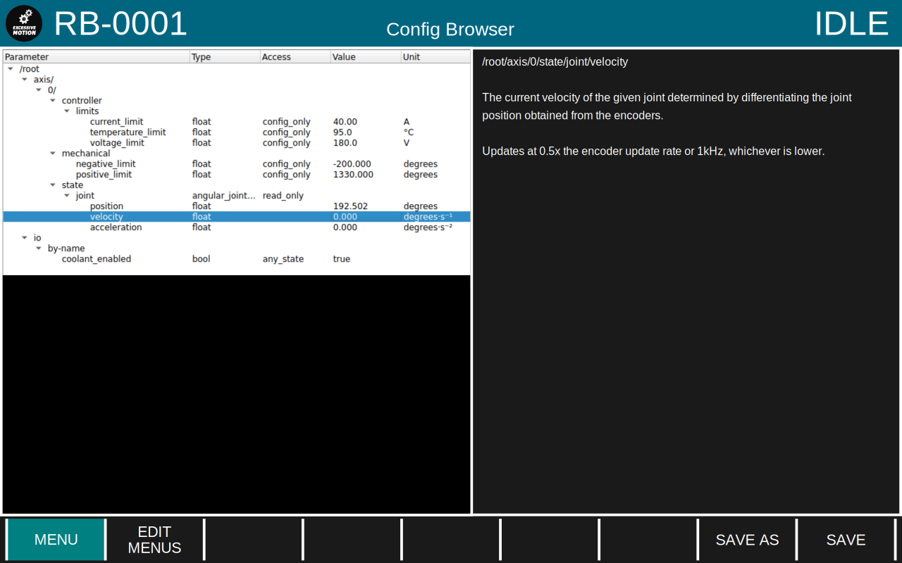

This document provides an outline of the required elements of the GUI.

> [!IMPORTANT]
> The styling in this document is not yet final.
> This is currently intended for getting an idea of what we need to make; after we have that we can make it look prettier.

# Constant Elements

Parts of the GUI which are visible all the time.

## Top Bar

- Shows robot name, screen name and robot status.
- Coloured based on robot status, eg red for error, green for normal run, blue for idle, orange for teach.

## Menu Bar

- Positioned along the bottom of the screen to correspond with optional physical buttons.
- Always contains a "Menu" item.
- Other entries are configurable based on what is displayed on the main screen.

# Primary Screens

Screens that take up the entire display.

## Main Screen

Used for displaying data and interacting with the machine during normal operation

- Displays configurable grid of widgets which can display information and accept user input.
- The menu options are also configurable and would be used to change to other modes or for accessing settings etc via the buttons.

## Raw Config Screen

Provides a tree of all parameters on the controller with the ability to view and edit them.

 - Should also be accessible in a "picker" mode which can be used to select a parameter when configuring widgets in the UI editor or writing scripts in the script editors.

## File Manager

Provides access to the device filesystem. Pretty much just a typical file browser.

 - Allow moving files around, renaming etc.
 - Open files in the appropriate editor.
 - Upload files (scripts, config files, code updates etc)
 - Download files (logs, scripts etc)

## Text Editor

Allow editing of GCode and the scripting language.

Also would support checking the code for issues and showing the current line being executed.

## Visual Script Editor

Basically the same as the text editor, but does visual programming.

## UI Editor

Allow customisation of main screen layouts and creating script UIs.

# Overlay Screens

Screens that float above the current primary screen.

## Help screen

An overlay explaining the current screen. May also be accessible from other overlays if that's useful.

## Script UI

An overlay launched by the currently-executing script for prompting the user etc.

# Widgets

## Static

- Static text
- Static image

## Display

- System log
- Current GCode/script (and surrounding lines)
- Parameter (various datatypes - coordinates, float/integer etc)
- Gauge
- Bar
- 3D viewport
- Live graph/oscilloscope

## Interaction

- Editor (same as the full-screen visual/text editors above but embedded)

## Controls

- Switch (eg for controlling coolant on/off)
- Dial (eg for feed rate override

## Script UI

Elements only available to UIs spawned by scripts (because they need information from the script to make any sense)

- Text/float/combo/etc input
- Button
- Progress bar/spinner

# Startup UI

A splash page that displays while the UI is loading.

# Pendant UI

We should probably have a bit of GUI built into the CEF app in order to handle network configuration and do some basic fault diagnosis in case the main UI isn't available.
