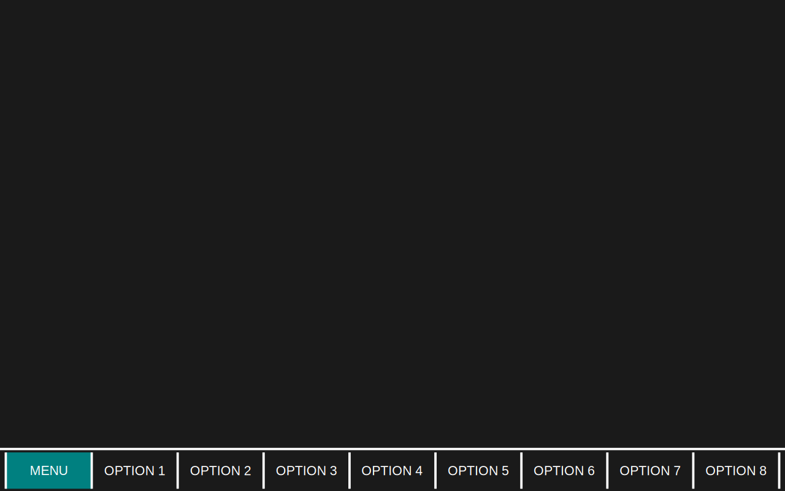

# Constant Elements

Parts of the screen which are visible all the time.

## Top Bar

 * Displays robot name, screen name and robot status.  Coloured based on robot status.

## Menu Bar

 * Positioned along the bottom of the screen to correspond with optional physical buttons.
 * Always contains a "Menu" item.
 * Other entries are configurable based on what is displayed on the main screen.

# Primary Screens

Screens that take up the entire display.

## Main Screen

Used for displaying data and interacting with the machine during normal operation

 * Displays configurable grid of widgets
 * Configurable menu that can be used to change to other modes

## Raw Config Screen

Provides a tree of all parameters on the controller with the ability to view and edit them.

## File Manager

Provides access to the device filesystem.  Pretty much just a typical file browser.

## Text Editor

Allow editing of GCode etc.

## Visual Script Editor

Basically the same as the text editor, but does visual programming.

## UI Editor

Allow customisation of main screen layouts and creating script UIs.

# Overlay Screens

Screens that float above the current primary screen.

## Help screen

An overlay explaining the current screen.  May also be accessible from other overlays if that's useful.

## Script UI

An overlay launched by the currently-executing script for prompting the user etc.

# Widgets

## Static

 * Static text
 * Static image

## Display

 * System log
 * Current GCode/script (and surrounding lines)
 * Parameter (various datatypes - coordinates, float/integer etc)
 * Gauge
 * Bar
 * 3D viewport
 * Live graph/oscilloscope

## Interaction

 * Editor (same as the full-screen visual/text editors above but embedded)

## Controls

 * Switch (eg for controlling coolant on/off)
 * Dial (eg for feed rate override

## Script UI

 * Text/float/combo/etc input
 * Button
